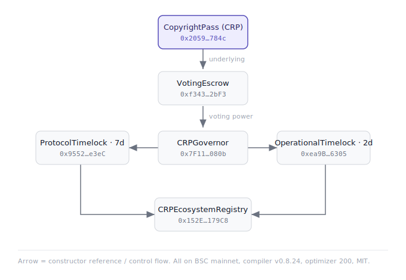

# CRP Contracts

Official smart contract verification materials for CopyrightPass (CRP) on BNB Smart Chain Mainnet.

This repository publishes the public verification records, contract architecture, and BscScan verification bundle for the CRP protocol contracts.

---

## Purpose

This repository is used for:

- Public contract verification reference
- BscScan Standard JSON Input archival
- Constructor argument documentation
- Smart contract architecture documentation
- Re-verification support for auditors, explorers, and ecosystem partners

The full verification bundle is published through GitHub Releases.

---

## Network

| Item | Value |
|---|---|
| Chain | BNB Smart Chain Mainnet |
| Chain ID | 56 |
| Compiler | `v0.8.24+commit.e11b9ed9` |
| Optimizer | Enabled, 200 runs |
| EVM Version | `cancun` |
| viaIR | `false` |
| License | MIT |
| Code Format | Solidity Standard JSON Input |

---

## Core Contracts

| Contract | Address | BscScan |
|---|---|---|
| CopyrightPass (CRP Token) | `0x2059b3cdb31abaeBc9E313246795b754F8A2784c` | [View](https://bscscan.com/address/0x2059b3cdb31abaeBc9E313246795b754F8A2784c) |
| VotingEscrow | `0xf34376DED6806afD98fc5CA164582459D0A62bF3` | [View](https://bscscan.com/address/0xf34376DED6806afD98fc5CA164582459D0A62bF3) |
| CRPGovernor | `0x7F115028C2E1f70cb4A8E84062e1803e8AfA080b` | [View](https://bscscan.com/address/0x7F115028C2E1f70cb4A8E84062e1803e8AfA080b) |
| ProtocolTimelock | `0x955262f7ED80708d09643195c2a4Cf45abdee3eC` | [View](https://bscscan.com/address/0x955262f7ED80708d09643195c2a4Cf45abdee3eC) |
| OperationalTimelock | `0xea9B9a25532481cd89236Ec5612282dA8d6E6305` | [View](https://bscscan.com/address/0xea9B9a25532481cd89236Ec5612282dA8d6E6305) |
| CRPEcosystemRegistry | `0x152E93dE6c1e02a726f11C672B641FDf4e3179C8` | [View](https://bscscan.com/address/0x152E93dE6c1e02a726f11C672B641FDf4e3179C8) |

---

## Protocol Architecture

The CRP protocol uses a six-contract architecture:

| Layer | Contract | Purpose |
|---|---|---|
| Token Layer | CopyrightPass (CRP Token) | Fixed-supply BEP-20 token with Permit and Votes support |
| Voting Layer | VotingEscrow | CRP-based voting power and governance participation |
| Governance Layer | CRPGovernor | Proposal creation, voting, and governance execution |
| Protocol Control Layer | ProtocolTimelock | 7-day timelock for major protocol-level actions |
| Operational Control Layer | OperationalTimelock | 2-day timelock for operational updates |
| Registry Layer | CRPEcosystemRegistry | Registry for ecosystem certification, PLR, and protocol records |

If `architecture.svg` is available in this repository, the rendered architecture diagram can be viewed here:



---

## Verification Bundle

The official CRP BscScan verification bundle is published through GitHub Releases.

Recommended release asset name:

`CRP_BscScan_Verification_Bundle_v1.0.0.zip`

The bundle includes:

- Standard JSON Input files for BscScan verification
- Minified Standard JSON Input files for submission
- Reconstructed Solidity source trees
- Constructor arguments
- Contract architecture diagram
- Verification helper script
- English / Chinese verification documentation

---

## Bundle Structure

The verification bundle is organized as:

```text
verification/
  README.md
  VERIFICATION.md
  architecture.svg
  verify-all.sh
  CopyrightPass/
  VotingEscrow/
  CRPGovernor/
  ProtocolTimelock/
  OperationalTimelock/
  CRPEcosystemRegistry/
